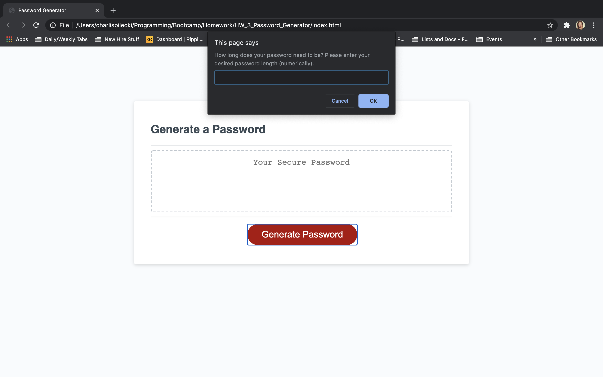
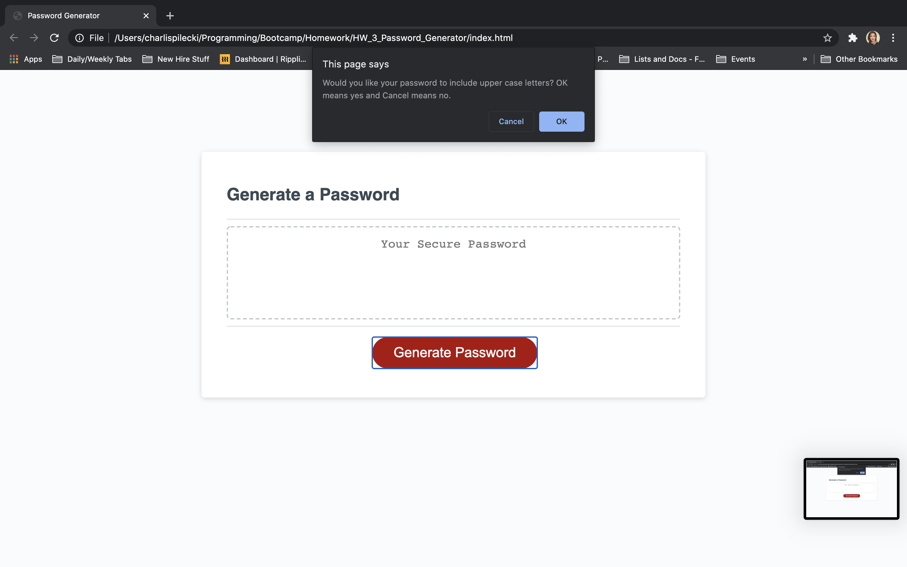
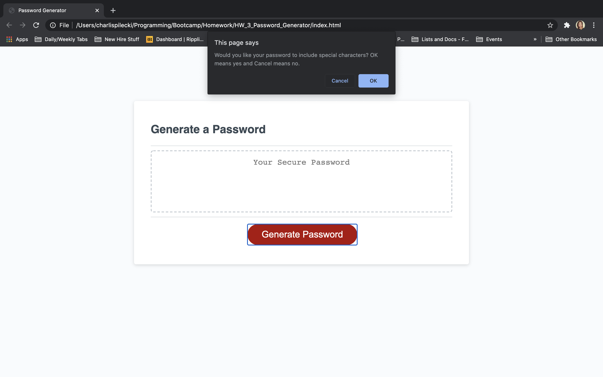
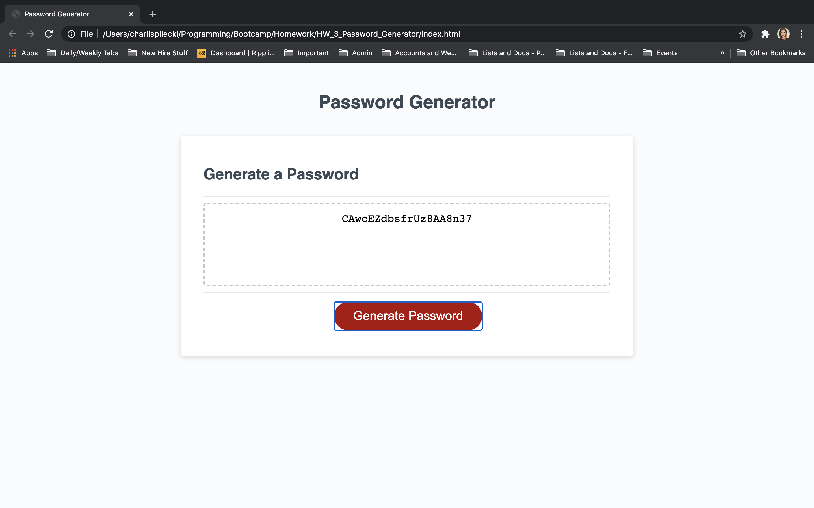

# 03 JavaScript: Password Generator

## About This Assignment

For this project, I primarily worked with Javascript to create a functional password generator that allows the user to select the length and types of characters they want for their password. The password generator then creates a random password using the selected criteria. The random nature and inclusion of upper case letters, lower case letters, numbers, and special characters allows the user to create a very safe and secure password. 

More specifically:

For the Javascript
* Added variables regarding the criteria and password
* Created arrays for the various critera (numbers, letters, special characters, etc)
* Wrote functions that utilized if statements, the aforementioned variables and arrays, loops, etc to clean up my code and make it more dynamic 
* Included comments that hopefully make my code easier to understand and read 

## Link to Deployed Website
https://charlispilecki.github.io/HW_3_Password_Generator/

## Screenshots

